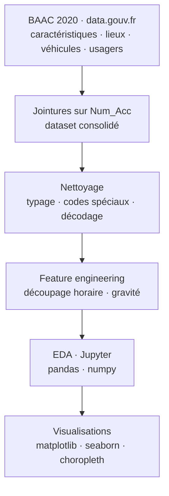

# Accidentologie BAAC · Analyse Open Data 2020

<!-- adam-badges:start -->
[](https://github.com/Adam-Blf/accidentologie-baac-20/commits) [](https://hits.sh/github.com/Adam-Blf/accidentologie-baac-20/) [](https://github.com/Adam-Blf/accidentologie-baac-20/commits) [](https://github.com/Adam-Blf/accidentologie-baac-20) [](LICENSE)
<!-- adam-badges:end -->


Analyse de l'accidentologie routiere en France a partir du fichier BAAC 2020 (Bulletin d'Analyse des Accidents Corporels de la Circulation) publie par le Ministere de l'Interieur. Projet academique note 20/20.

## Architecture



## Contexte

Projet academique EFREI · Mastere Data Engineering & IA · Master 1. Livrable data analysis avec EDA, dataviz et enseignements metier sur l'insecurite routiere francaise.

## Probleme resolu

Identifier les facteurs de risque d'accidents corporels sur le reseau routier francais (type de voie, meteo, horaires, profil des usagers, gravite) et produire un rapport data narratif reproductible.

## Methode

- Ingestion des 4 fichiers BAAC (`caracteristiques`, `lieux`, `vehicules`, `usagers`) publies sur data.gouv.fr
- Jointures sur `Num_Acc` · consolidation en un dataset enrichi
- Nettoyage · typage, gestion des valeurs speciales BAAC (-1, 0 codes), decodage des dictionnaires officiels
- Feature engineering · decoupage horaire, categorisation de la gravite (indemne / blesse leger / hospitalise / tue)
- EDA · distribution geographique (departements), temporelle (mois, jour de semaine, heure), facteurs meteo et usage
- Visualisations · matplotlib + seaborn, cartes choropleth par departement

## Stack

- **Langage** · Python 3
- **Libs** · pandas, numpy, matplotlib, seaborn
- **Data source** · [BAAC 2020 sur data.gouv.fr](https://www.data.gouv.fr/fr/datasets/bases-de-donnees-annuelles-des-accidents-corporels-de-la-circulation-routiere-annees-de-2005-a-2022/)
- **Notebook** · Jupyter

## Resultats cles

- Note academique · **20/20**
- Pics horaires identifies · 8h-9h et 17h-19h (trajets domicile-travail)
- Gravite maximale concentree sur routes departementales hors agglomeration
- Surrepresentation de la tranche 18-24 ans dans les usagers impliques

## Reproduction

```bash
git clone https://github.com/Adam-Blf/accidentologie-baac-20
cd accidentologie-baac-20
pip install pandas numpy matplotlib seaborn jupyter
jupyter notebook
```

## Licence

MIT

---

<p align="center">
  <sub>Par <a href="https://adam.beloucif.com">Adam Beloucif</a> · Data Engineer & Fullstack Developer · <a href="https://github.com/Adam-Blf">GitHub</a> · <a href="https://www.linkedin.com/in/adambeloucif/">LinkedIn</a></sub>
</p>